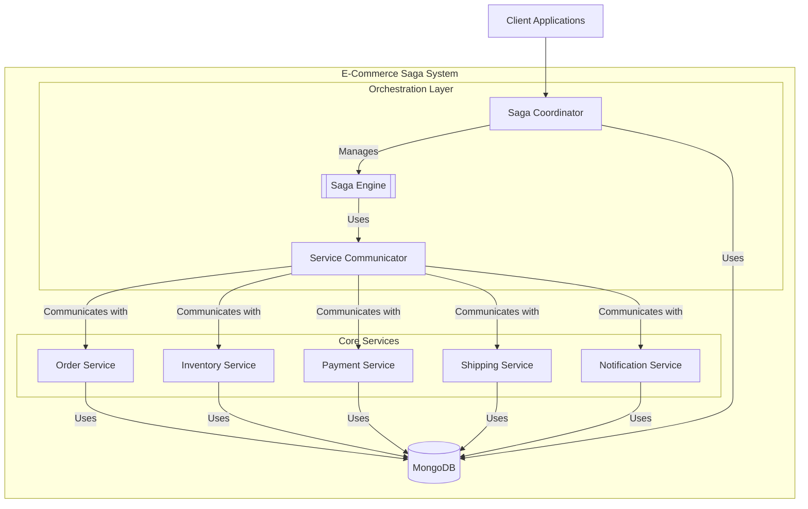

# E-Commerce Saga System - Architectural Review

## 1. Executive Summary

This document provides a comprehensive architectural review of the E-Commerce Saga System. The system is a well-designed microservices application that leverages the Saga Orchestration pattern to manage distributed transactions effectively.

The architecture is built on a modern technology stack, including Python/FastAPI, MongoDB, and Docker/Kubernetes, which provides a solid foundation for scalability and resilience. The project demonstrates a high level of maturity, with a strong focus on developer experience, automated testing, and observability.

The core of the architecture is the `Saga Coordinator`, which orchestrates the flow of transactions across the various microservices. The implementation of the saga pattern is robust and generic, allowing for easy extension to other business processes.

While the current architecture is excellent, this review identifies several potential areas for improvement, including the adoption of a more dynamic service discovery mechanism, the introduction of asynchronous communication, and the implementation of a GraphQL API gateway to enhance the client-side experience.

Overall, the E-Commerce Saga System is a well-architected application that serves as a great example of how to build a resilient and maintainable microservices system.

## 2. Architecture Overview

The system follows a classic microservices architecture, with a central `Saga Coordinator` orchestrating the interactions between the services.

### Key Architectural Characteristics:

*   **Microservices:** The application is decomposed into five core services, each with a distinct business capability.
*   **Saga Orchestration:** A central `Saga Coordinator` manages the distributed transaction, ensuring that the system remains in a consistent state even in the face of failures.
*   **Shared Database:** All services share a single MongoDB database. While this simplifies development and data consistency checks, it can become a bottleneck and a single point of failure in a large-scale system.
*   **Synchronous Communication:** Services communicate with each other via synchronous HTTP requests, which are managed by the `ServiceCommunicator`.

## 3. Key Components Analysis

### 3.1. Saga Coordinator and OrderSaga

The `Saga Coordinator` is the heart of the orchestration layer. The [`OrderSaga`](src/coordinator/order_saga.py:12) class provides a clear, declarative definition of the order processing workflow. Each step in the saga is defined with its corresponding action and compensation endpoints, making the business logic easy to follow.

### 3.2. Generic Saga Engine

The generic [`Saga`](src/common/saga.py:55) and [`SagaStep`](src/common/saga.py:13) classes in [`src/common/saga.py`](src/common/saga.py) provide a reusable and robust implementation of the saga pattern. The engine handles the core orchestration logic, including step execution, state management, context passing, and compensation. This separation of concerns is a key strength of the architecture.

### 3.3. Service Communicator

The [`ServiceCommunicator`](src/common/messaging.py:11) class in [`src/common/messaging.py`](src/common/messaging.py) abstracts the details of inter-service communication. It provides a resilient communication layer with built-in support for retries and health checks. The current implementation uses a simple service discovery mechanism based on environment variables, which is effective for the current setup but could be improved.

## 4. Data Consistency Strategy

Data consistency is a critical concern in any microservices architecture. This system addresses it through two primary mechanisms:

*   **Saga Compensations:** The saga pattern itself is the first line of defense against data inconsistencies. If a step in the transaction fails, the saga engine automatically triggers the compensation actions for the preceding steps, effectively rolling back the transaction.
*   **Proactive Consistency Checking:** The [`data_consistency_checker.py`](tools/data_consistency_checker.py) tool provides a powerful mechanism for proactively identifying and reporting data integrity issues. The tool connects directly to the database and runs a comprehensive set of checks to find inconsistencies that may have slipped through the cracks.

This two-pronged approach provides a high degree of confidence in the system's data integrity.

## 5. Strengths

*   **Robust Transaction Management:** The saga orchestration pattern is well-implemented and provides a reliable mechanism for managing distributed transactions.
*   **Clear Separation of Concerns:** The code is well-organized, with a clear distinction between business logic, orchestration logic, and communication logic.
*   **Excellent Developer Experience:** The project includes comprehensive documentation, a powerful `Makefile` for automating common tasks, and a suite of tools for testing and monitoring.
*   **Mature Observability:** The inclusion of centralized logging, health checks, and a dedicated data consistency checker demonstrates a mature approach to observability.

## 6. Potential Areas for Improvement

While the current architecture is robust and well-designed, there are several areas where it could be enhanced to further improve its scalability, resilience, and maintainability.

1.  **Service Discovery Mechanism:**
    *   **Current State:** The [`ServiceCommunicator`](src/common/messaging.py:11) relies on environment variables and a hardcoded port mapping to discover other services. This approach, while functional for local development and the current Kubernetes setup, can be brittle and requires manual configuration updates when services are added or relocated.
    *   **Suggestion:** Implement a more dynamic service discovery mechanism. In a Kubernetes environment, this can be achieved by leveraging the built-in DNS resolution for services. For more advanced scenarios, a service mesh like Istio or Linkerd could be introduced to provide a dedicated control plane for service-to-service communication.
    *   **Benefits:**
        *   **Increased Resilience:** The system can automatically adapt to changes in the deployment environment, such as services being rescheduled to different nodes.
        *   **Simplified Configuration:** Eliminates the need for hardcoded URLs and manual configuration updates.

2.  **Asynchronous Communication for Saga Steps:**
    *   **Current State:** The saga execution is currently synchronous, with the `Saga Coordinator` making blocking HTTP calls to each service. This tight coupling can impact scalability and resilience, as a slow or unresponsive service can block the entire saga.
    *   **Suggestion:** Transition to an asynchronous, message-based communication pattern using a message broker like RabbitMQ or Kafka. In this model, the `Saga Coordinator` would publish command messages to a queue, and each service would subscribe to its relevant commands. Upon completion, the service would publish an event, which the coordinator would then consume to trigger the next step in the saga.
    *   **Benefits:**
        *   **Improved Decoupling:** Services are no longer directly aware of each other, which reduces dependencies and improves maintainability.
        *   **Enhanced Scalability and Resilience:** The message broker can act as a buffer, allowing services to process messages at their own pace and providing built-in support for retries and dead-letter queues.

3.  **Explicit Idempotency Handling:**
    *   **Current State:** The [`ServiceCommunicator`](src/common/messaging.py:11) includes a retry mechanism, which is crucial for handling transient network failures. However, it's not explicitly clear if the service endpoints are idempotent. A non-idempotent endpoint could lead to data corruption if a request is retried (e.g., processing the same payment twice).
    *   **Suggestion:** Enforce idempotency at the service level for all operations that modify data. This can be achieved by requiring a unique idempotency key (e.g., the `saga_id` plus the `step_index`) for each request. Services would then track the keys they have already processed and reject any duplicates.
    *   **Benefits:**
        *   **Guaranteed Data Consistency:** Prevents duplicate operations and ensures that the system remains in a consistent state, even in the face of network retries.

4.  **Centralized Configuration Management:**
    *   **Current State:** Configuration is managed through environment variables, which are loaded using `python-dotenv`. While this is a standard practice, it can become cumbersome as the number of services and configuration parameters grows.
    *   **Suggestion:** Adopt a centralized configuration management system, such as HashiCorp Consul, etcd, or a cloud-native solution like AWS Parameter Store or Azure App Configuration. This would provide a single source of truth for all configuration data, including secrets.
    *   **Benefits:**
        *   **Simplified Management:** Configuration can be managed and updated from a central location, without requiring service restarts.
        *   **Improved Security:** Secrets can be managed more securely, with fine-grained access control and auditing capabilities.

5.  **GraphQL API Gateway for Client Applications:**
    *   **Current State:** Client applications interact directly with the REST APIs of the `Saga Coordinator` and potentially other services. This can lead to clients making multiple requests to fetch all the data they need (under-fetching) or receiving more data than necessary (over-fetching).
    *   **Suggestion:** Introduce an API Gateway that exposes a unified GraphQL API to client applications. This gateway would be responsible for aggregating data from the various downstream microservices and presenting it in a single, coherent graph.
    *   **Benefits:**
        *   **Efficient Data Fetching:** Clients can specify their exact data requirements in a single query, eliminating multiple API calls and improving performance.
        *   **Simplified Client Logic:** Decouples the frontend from the backend microservices, allowing the backend to evolve without breaking client applications.
        *   **Strongly Typed Schema:** Provides a clear, self-documenting contract between the client and the server, improving developer experience and enabling powerful tooling.