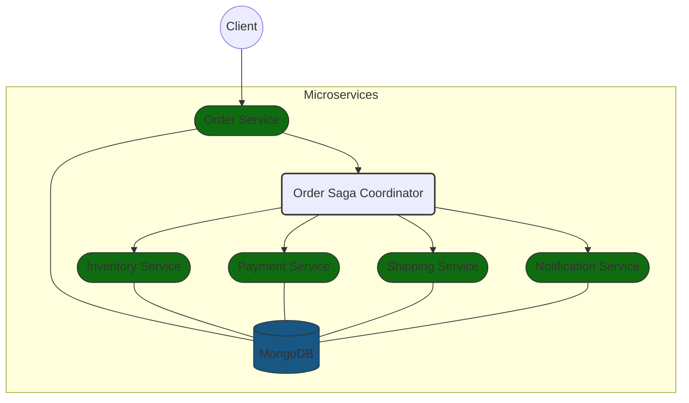
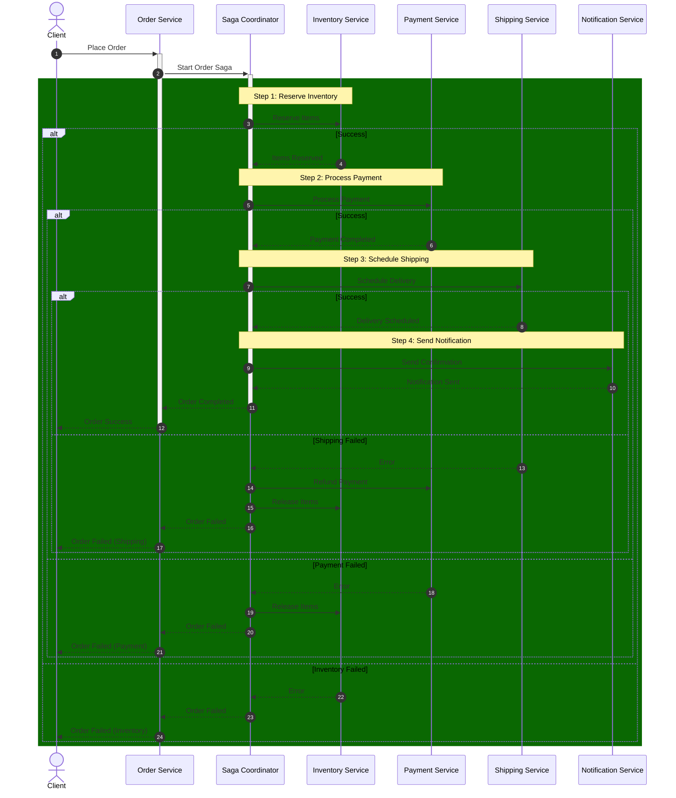
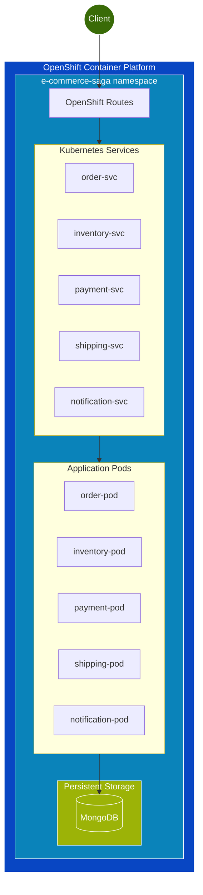

# E-Commerce Order Management with Saga Pattern

This project demonstrates a microservices-based e-commerce backend where the **order processing** flow is handled using the **Saga pattern with orchestration**.

## Overview

When a user places an order, a distributed transaction occurs across multiple services, orchestrated using the Saga pattern to ensure data consistency across microservices.

## Architecture

### System Components



### Service Roles

| Service | Role | Key Operations |
|---------|------|----------------|
| Order Service | Creates and manages orders | Create, Cancel, Update order status |
| Order Saga Coordinator | Orchestrates the distributed transaction | Execute saga steps, Handle compensations |
| Inventory Service | Manages product inventory | Reserve, Release items |
| Payment Service | Handles payment processing | Process payment, Issue refund |
| Shipping Service | Manages order delivery | Schedule, Cancel delivery |
| Notification Service | Sends user notifications | Order confirmation, Status updates |

## Saga Pattern Implementation

### Sequence Flow



### Compensation Mechanism

The Saga pattern ensures data consistency by defining compensating actions for each step:

1. **Order Creation**
   - Action: Create order record
   - Compensation: Cancel order

2. **Inventory Reservation**
   - Action: Reserve items
   - Compensation: Release reserved items

3. **Payment Processing**
   - Action: Charge payment
   - Compensation: Issue refund

4. **Shipping Scheduling**
   - Action: Schedule delivery
   - Compensation: Cancel shipping

5. **Notification** (Optional)
   - Action: Send confirmation
   - Compensation: Send cancellation notice

## Deployment Architecture



## Technical Details

### Tech Stack

- **Language**: Python 3.11
- **Framework**: FastAPI
  - High-performance async web framework
  - Automatic OpenAPI/Swagger documentation
  - Built-in request/response validation
- **Database**: MongoDB
  - Document-based NoSQL database
  - Perfect for microservices with flexible schemas
  - Async driver support
- **Containerization**: 
  - Podman/Docker for containerization
  - Multi-stage builds for optimized images
  - Shared base image for common dependencies
- **Deployment**: 
  - OpenShift Container Platform
  - Helm charts for orchestrated deployment
  - Auto-scaling and high availability

### Key Implementation Features

1. **Saga Pattern Implementation**
   ```python
   class Saga:
       def __init__(self, saga_id: str, description: str = ""):
           self.id = saga_id
           self.steps: List[SagaStep] = []
           self.status = SagaStatus.STARTED
           self.context: Dict[str, Any] = {"saga_id": saga_id}
   ```

2. **Asynchronous Communication**
   - HTTP-based service communication
   - Async/await for non-blocking operations
   - Retry mechanisms for resilience

3. **Error Handling**
   - Comprehensive compensation logic
   - Transaction rollback on failures
   - Detailed error tracking and logging

4. **Monitoring & Observability**
   - OpenAPI documentation at `/docs`
   - Status endpoints for each service
   - Transaction tracing via saga_id

## Getting Started

### Prerequisites

- Python 3.11+
- MongoDB
- Podman or Docker
- OpenShift Local (formerly CRC)

### Running Locally with Docker Compose

```bash
# Start all services
docker-compose up -d

# Check running services
docker-compose ps
```

### Running Locally with Podman

```bash
# Install dependencies
pip install -r common/requirements.txt

# Start MongoDB with Podman
podman run -d -p 27017:27017 --name saga-mongodb mongo:latest

# Run the services
./run-local.sh
```

### Deploying to OpenShift Local

#### 1. Prerequisites

- OpenShift Local installed and running
- `oc` CLI installed and configured
- Podman installed
- Helm installed

#### 2. Start OpenShift Local

```bash
# Start OpenShift Local (CRC)
crc start

# Login to OpenShift
oc login -u developer -p developer
```

#### 3. Automatic Deployment

The easiest way to deploy is using our automated script:

```bash
# Make the script executable
chmod +x deploy-openshift.sh

# Run the deployment script
./deploy-openshift.sh
```

This script will:
1. Build container images using Podman
2. Push images to the OpenShift registry
3. Deploy the application using Helm
4. Display the routes to access the services

#### 4. Manual Deployment

If you prefer to deploy manually:

```bash
# Build images with Podman
./build-podman.sh

# Push images to OpenShift registry
./push-to-openshift.sh

# Deploy using Helm
REGISTRY=$(oc get route default-route -n openshift-image-registry --template='{{ .spec.host }}')
helm install e-commerce-saga ./helm --set global.imageRegistry=$REGISTRY/e-commerce-saga
```

#### 5. Accessing the Application

After deployment, you can access the services through their OpenShift routes:

```bash
# Get the routes
oc get routes
```

The API documentation is available at the `/docs` endpoint of each service.

## API Documentation

Each service provides a SwaggerUI interface at `/docs` endpoint for interactive API testing.

### Order Service (Port 8000)

#### Public Endpoints
- `POST /api/orders`
  - Create a new order and start saga
  - Request: Order details with items, payment, shipping info
  - Response: Saga ID and order status

- `GET /api/orders/{order_id}`
  - Get order details with saga status
  - Response: Complete order details with transaction history

- `GET /api/orders`
  - List orders with pagination
  - Query params: customer_id, status, limit, skip

#### Saga Endpoints
- `POST /api/orders/create` - Create order record (saga)
- `POST /api/orders/cancel` - Cancel order (compensation)

### Inventory Service (Port 8001)

#### Public Endpoints
- `GET /api/inventory`
  - List available inventory
  - Query params: category, inStock, limit, skip

- `GET /api/inventory/{product_id}`
  - Get product inventory details
  - Response: Stock levels, reservations

#### Saga Endpoints
- `POST /api/inventory/reserve` - Reserve inventory items
- `POST /api/inventory/release` - Release reservation (compensation)

### Payment Service (Port 8002)

#### Public Endpoints
- `GET /api/payments`
  - List payments with filtering
  - Query params: customer_id, status, date_range

- `GET /api/payments/{payment_id}`
  - Get payment transaction details
  - Response: Payment status, method, amount

#### Saga Endpoints
- `POST /api/payments/process` - Process payment
- `POST /api/payments/refund` - Issue refund (compensation)

### Shipping Service (Port 8003)

#### Public Endpoints
- `GET /api/shipping`
  - List shipments
  - Query params: customer_id, status, date_range

- `GET /api/shipping/{shipping_id}`
  - Get shipping details
  - Response: Tracking info, delivery status

#### Saga Endpoints
- `POST /api/shipping/schedule` - Schedule delivery
- `POST /api/shipping/cancel` - Cancel shipping (compensation)

### Notification Service (Port 8004)

#### Public Endpoints
- `GET /api/notifications`
  - List notifications
  - Query params: customer_id, type, read_status

- `GET /api/notifications/{notification_id}`
  - Get notification details
  - Response: Message content, timestamp

#### Saga Endpoints
- `POST /api/notifications/send` - Send notification
- `POST /api/notifications/cancel` - Cancel notification (compensation)

## License

This project is licensed under the MIT License - see the LICENSE file for details. 