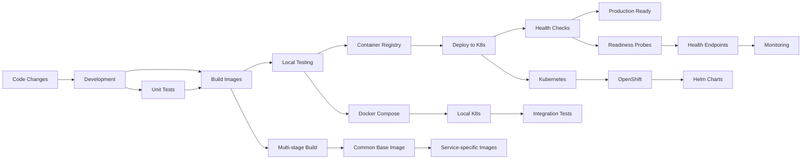

# E-Commerce Order Management with Saga Pattern

This project demonstrates a microservices-based e-commerce backend where the **order processing** flow is handled using the **Saga pattern with orchestration**.

## 📋 Table of Contents

- [Overview](#overview)
- [Architecture](#architecture)
- [API Documentation](#api-documentation)
- [Getting Started](#getting-started)
- [Development Environment](#development-environment)
- [DevOps Flow](#devops-flow)
- [Deployment Options](#deployment-options)
- [Monitoring & Health Checks](#monitoring--health-checks)
- [Troubleshooting](#troubleshooting)

## Overview

When a user places an order, a distributed transaction occurs across multiple services, orchestrated using the Saga pattern to ensure data consistency across microservices.

### Tech Stack

- **Language**: Python 3.11
- **Framework**: FastAPI (with automatic OpenAPI/Swagger documentation)
- **Database**: MongoDB
- **Containerization**: Docker/Podman
- **Orchestration**: Kubernetes/OpenShift
- **Deployment**: Helm charts
- **Monitoring**: OpenTelemetry, Prometheus metrics

## Architecture

### System Components


### Service Roles

| Service | Role | Port | Key Operations |
|---------|------|------|----------------|
| Order Service | Creates and manages orders | 8000 | Create, Cancel, Update order status |
| Order Saga Coordinator | Orchestrates the distributed transaction | - | Execute saga steps, Handle compensations |
| Inventory Service | Manages product inventory | 8001 | Reserve, Release items |
| Payment Service | Handles payment processing | 8002 | Process payment, Issue refund |
| Shipping Service | Manages order delivery | 8003 | Schedule, Cancel delivery |
| Notification Service | Sends user notifications | 8004 | Order confirmation, Status updates |

## API Documentation

### 🔗 Interactive API Documentation

Access the complete API documentation with interactive testing:

**Primary Documentation Portal:**
```
http://localhost:8000/docs
```

**Individual Service Documentation:**
- **Order Service**: http://localhost:8000/docs
- **Inventory Service**: http://localhost:8001/docs  
- **Payment Service**: http://localhost:8002/docs
- **Shipping Service**: http://localhost:8003/docs
- **Notification Service**: http://localhost:8004/docs

### API Endpoints Summary

#### Order Service (port 8000)
- `GET /health` — Health check
- `GET /metrics` — Metrics endpoint
- `GET /docs` — Interactive API documentation

#### Inventory Service (port 8001)
- `GET /` — Service status
- `GET /docs` — Interactive API documentation
- `GET /api/inventory` — List inventory (filters: status, limit, skip)
- `GET /api/inventory/{product_id}` — Get product by ID
- `POST /api/inventory/reserve` — Reserve inventory for an order
- `POST /api/inventory/release` — Release reserved inventory (compensation)
- `PUT /api/inventory/{product_id}` — Update inventory quantity

#### Payment Service (port 8002)
- `GET /` — Service status
- `GET /docs` — Interactive API documentation
- `GET /api/payments` — List payments (filters: customer_id, status, limit, skip)
- `GET /api/payments/{payment_id}` — Get payment by ID
- `GET /api/payments/order/{order_id}` — Get payment by order ID
- `POST /api/payments/process` — Process a payment
- `POST /api/payments/refund` — Refund a payment (compensation)

#### Shipping Service (port 8003)
- `GET /` — Service status
- `GET /docs` — Interactive API documentation
- `GET /api/shipping` — List shipments (filters: customer_id, status, limit, skip)
- `GET /api/shipping/{shipping_id}` — Get shipping by ID
- `GET /api/shipping/order/{order_id}` — Get shipping by order ID
- `POST /api/shipping/schedule` — Schedule shipping for an order
- `POST /api/shipping/cancel` — Cancel shipping (compensation)
- `PUT /api/shipping/{shipping_id}/status` — Update shipping status

#### Notification Service (port 8004)
- `GET /` — Service status
- `GET /docs` — Interactive API documentation
- `GET /api/notifications` — List notifications (filters: customer_id, order_id, status, notification_type, limit, skip)
- `GET /api/notifications/{notification_id}` — Get notification by ID
- `POST /api/notifications/send` — Send a notification
- `POST /api/notifications/cancel` — Cancel a notification (compensation)

## Getting Started

### Prerequisites

- Python 3.11+
- Docker or Podman
- Kubernetes (local: kind, k3s, Docker Desktop) or OpenShift Local
- kubectl CLI
- Helm (optional, for OpenShift deployment)

### Quick Start

1. **Clone the repository**
   ```bash
   git clone <repository-url>
   cd e-commerce-saga
   ```

2. **Choose your deployment method:**

   **Option A: Docker Compose (Simplest)**
   ```bash
   docker-compose up -d
   ```

   **Option B: Kubernetes (Recommended for development)**
   ```bash
   ./deploy-local-k8s.sh
   ```

   **Option C: OpenShift**
   ```bash
   ./deploy-openshift.sh
   ```

## Development Environment

### Setting Up Development Environment

1. **Create Python virtual environment**
   ```bash
   python -m venv venv
   source venv/bin/activate  # On Windows: venv\Scripts\activate
   pip install -r common/requirements.txt
   ```

2. **Start MongoDB**
   ```bash
   podman run -d -p 27017:27017 --name saga-mongodb mongo:latest
   ```

3. **Run services locally**
   ```bash
   ./run-local.sh
   ```

### Development with Kubernetes

After deploying to Kubernetes, set up port forwarding for local development and testing:

```bash
# Port forward all services for development
kubectl port-forward -n e-commerce-saga svc/order-service 8000:8000 & \
kubectl port-forward -n e-commerce-saga svc/inventory-service 8001:8001 & \
kubectl port-forward -n e-commerce-saga svc/payment-service 8002:8002 & \
kubectl port-forward -n e-commerce-saga svc/shipping-service 8003:8003 & \
kubectl port-forward -n e-commerce-saga svc/notification-service 8004:8004 &

# Stop all port forwarding
pkill -f "kubectl port-forward"
```

### Testing the Services

```bash
# Check service health
python scripts/check_health.py

# Clean up ports (if needed)
./scripts/cleanup_ports.sh

# Test individual services
curl http://localhost:8000/health  # Order service
curl http://localhost:8001/        # Inventory service
curl http://localhost:8002/        # Payment service
```

## DevOps Flow

### Development to Deployment Pipeline



### 1. Development Phase

**Code Development:**
- Follow microservices best practices
- Use FastAPI for REST APIs with automatic documentation
- Implement saga pattern for distributed transactions
- Write unit tests for each service

**Local Development:**
```bash
# Setup development environment
python -m venv venv
source venv/bin/activate
pip install -r common/requirements.txt

# Start individual services for development
cd services/order && python -m uvicorn main:app --reload --port 8000
cd services/inventory && python -m uvicorn main:app --reload --port 8001
# ... (or use run-local.sh)
```

### 2. Build Phase

**Container Image Building:**
```bash
# Build base image (shared dependencies)
docker build -t e-commerce-saga-base .

# Build service-specific images
for service in order inventory payment shipping notification; do
  docker build -t e-commerce-saga/${service}-service:latest \
    --build-arg SERVICE_DIR=${service} .
done
```

**Image Optimization:**
- Multi-stage builds for smaller images
- Common base image for shared dependencies
- Layer caching for faster builds
- Security scanning (recommended)

### 3. Local Testing Phase

**Docker Compose Testing:**
```bash
# Full stack testing
docker-compose up -d

# Run health checks
python scripts/check_health.py

# Integration testing
pytest services/*/tests/
```

**Kubernetes Testing:**
```bash
# Deploy to local Kubernetes
./deploy-local-k8s.sh

# Test with port forwarding
kubectl port-forward -n e-commerce-saga svc/order-service 8000:8000 &
# ... (other services)

# Verify deployment
kubectl get pods -n e-commerce-saga
kubectl logs -n e-commerce-saga deployment/order-service
```

### 4. Container Registry Phase

**Image Tagging and Pushing:**
```bash
# Tag images for registry
docker tag e-commerce-saga/order-service:latest registry.example.com/order-service:v1.0.0

# Push to registry
docker push registry.example.com/order-service:v1.0.0

# For OpenShift internal registry
./push-to-openshift.sh
```

### 5. Deployment Phase

**Kubernetes Deployment:**
```bash
# Apply Kubernetes manifests
kubectl apply -f k8s-local-deployment.yaml

# Or use Helm for more complex deployments
helm install e-commerce-saga ./helm
```

**OpenShift Deployment:**
```bash
# Automated OpenShift deployment
./deploy-openshift.sh

# Manual deployment steps
oc new-project e-commerce-saga
oc apply -f openshift-deployment.yaml
```

### 6. Health Checks & Monitoring

**Health Check Implementation:**
- Each service implements health endpoints
- Kubernetes readiness and liveness probes
- Automated health monitoring

```bash
# Automated health checks
python scripts/check_health.py

# Kubernetes health verification
kubectl get pods -n e-commerce-saga
kubectl describe pods -n e-commerce-saga
```

**Monitoring Setup:**
- OpenTelemetry tracing
- Prometheus metrics collection
- Service mesh observability (optional)

### 7. Production Readiness

**Pre-production Checklist:**
- [ ] All health checks passing
- [ ] Integration tests successful
- [ ] Performance testing completed
- [ ] Security scanning passed
- [ ] Documentation updated
- [ ] Monitoring configured
- [ ] Backup strategies in place

## Deployment Options

### 1. Docker Compose (Development)

**Pros:** Simple, fast startup, good for local development
**Cons:** Not production-ready, limited scalability

```bash
# Start all services
docker-compose up -d

# Scale specific services
docker-compose up -d --scale inventory-service=3

# View logs
docker-compose logs -f inventory-service
```

### 2. Kubernetes (Recommended)

**Pros:** Production-ready, auto-scaling, self-healing, portable
**Cons:** More complex setup

```bash
# Deploy with build
./deploy-local-k8s.sh

# Manual deployment
kubectl apply -f k8s-local-deployment.yaml

# Scale services
kubectl scale deployment inventory-service --replicas=3 -n e-commerce-saga
```

### 3. OpenShift (Enterprise)

**Pros:** Enterprise features, built-in CI/CD, security, monitoring
**Cons:** More complex, requires OpenShift cluster

```bash
# Automated deployment
./deploy-openshift.sh

# Deploy with Helm
helm install e-commerce-saga ./helm --set global.environment=production
```

## Monitoring & Health Checks

### Health Check Scripts

```bash
# Check all services health
python scripts/check_health.py

# Clean up ports before deployment
./scripts/cleanup_ports.sh
```

### Service Health Endpoints

| Service | Health Endpoint | Status Endpoint |
|---------|----------------|-----------------|
| Order | `/health` | `/metrics` |
| Inventory | `/` | `/docs` |
| Payment | `/` | `/docs` |
| Shipping | `/` | `/docs` |
| Notification | `/` | `/docs` |

### Monitoring Features

- **OpenTelemetry Integration**: Distributed tracing across services
- **Prometheus Metrics**: Performance and business metrics
- **Health Checks**: Automated service health verification
- **Structured Logging**: Centralized logging with correlation IDs

## Troubleshooting

### Common Issues

**1. Port Conflicts**
```bash
# Clean up ports
./scripts/cleanup_ports.sh

# Check port usage
lsof -i :8000
netstat -tulpn | grep :8000
```

**2. Container Issues**
```bash
# Check container logs
docker logs saga-mongodb
kubectl logs -n e-commerce-saga deployment/inventory-service

# Restart services
docker-compose restart inventory-service
kubectl rollout restart deployment/inventory-service -n e-commerce-saga
```

**3. Database Connection Issues**
```bash
# Test MongoDB connection
mongo --eval "db.adminCommand('ping')"

# Check MongoDB in Kubernetes
kubectl exec -it deployment/mongodb -n e-commerce-saga -- mongo --eval "db.adminCommand('ping')"
```

**4. Health Check Failures**
```bash
# Debug health checks
curl -v http://localhost:8001/
curl -v http://localhost:8001/health

# Check service logs
kubectl logs -n e-commerce-saga deployment/inventory-service --tail=50
```

**5. Port Forwarding Issues**
```bash
# Kill existing port forwards
pkill -f "kubectl port-forward"

# Restart port forwarding
kubectl port-forward -n e-commerce-saga svc/inventory-service 8001:8001 &
```

### Debug Commands

```bash
# Kubernetes debugging
kubectl get pods -n e-commerce-saga -o wide
kubectl describe pod <pod-name> -n e-commerce-saga
kubectl logs <pod-name> -n e-commerce-saga --previous

# Docker debugging
docker ps -a
docker logs <container-name>
docker exec -it <container-name> /bin/bash

# Network debugging
kubectl get svc -n e-commerce-saga
kubectl get endpoints -n e-commerce-saga
```

### Performance Tuning

**Resource Limits:**
```yaml
resources:
  limits:
    memory: 128Mi
    cpu: 200m
  requests:
    memory: 64Mi
    cpu: 100m
```

**Scaling:**
```bash
# Horizontal scaling
kubectl scale deployment inventory-service --replicas=3 -n e-commerce-saga

# Auto-scaling (HPA)
kubectl autoscale deployment inventory-service --cpu-percent=70 --min=1 --max=5 -n e-commerce-saga
```

## Contributing

1. Fork the repository
2. Create a feature branch
3. Make your changes
4. Add tests
5. Update documentation
6. Submit a pull request

## License

This project is licensed under the MIT License - see the LICENSE file for details.

---

## Quick Reference

**Start Development Environment:**
```bash
./deploy-local-k8s.sh
kubectl port-forward -n e-commerce-saga svc/order-service 8000:8000 & \
kubectl port-forward -n e-commerce-saga svc/inventory-service 8001:8001 & \
kubectl port-forward -n e-commerce-saga svc/payment-service 8002:8002 & \
kubectl port-forward -n e-commerce-saga svc/shipping-service 8003:8003 & \
kubectl port-forward -n e-commerce-saga svc/notification-service 8004:8004 &
```

**API Documentation:**
- Main Portal: http://localhost:8000/docs
- All Services: http://localhost:800{0-4}/docs

**Health Check:**
```bash
python scripts/check_health.py
``` 