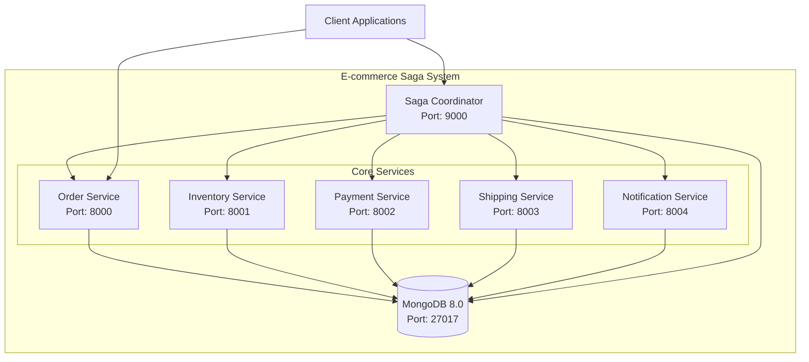
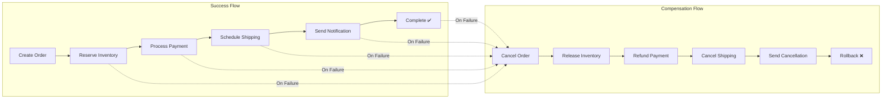
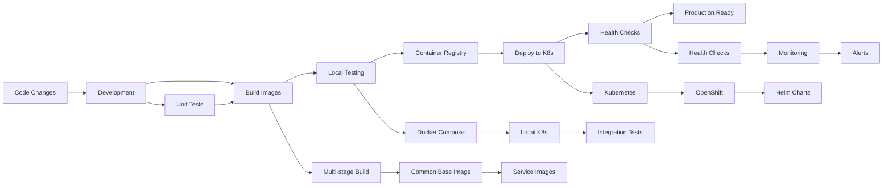

# E-Commerce Saga System - Complete Documentation

A comprehensive microservices-based e-commerce system implementing the **Saga Orchestration Pattern** for distributed transaction management. This system demonstrates robust transaction handling, failure recovery, system observability, and comprehensive testing in a cloud-native environment.


## 📚 Table of Contents

- [🏗️ Architecture Overview](#️-architecture-overview)
- [🚀 Quick Start](#-quick-start)
- [🔧 Development Workflows](#-development-workflows)
- [🧪 Testing & Quality Assurance](#-testing--quality-assurance)
- [📊 Monitoring & Observability](#-monitoring--observability)
- [🚀 Deployment Options](#-deployment-options)
- [📖 API Documentation](#-api-documentation)
- [💻 Development Environment](#-development-environment)
- [🛠️ DevOps Pipeline](#️-devops-pipeline)
- [🔍 Troubleshooting](#-troubleshooting)
- [📈 System Administration](#-system-administration)

## 🏗️ Architecture Overview

### System Architecture



### Technology Stack

- **Language**: Python 3.11
- **Framework**: FastAPI (with automatic OpenAPI/Swagger documentation)
- **Database**: MongoDB 8.0
- **Containerization**: Docker/Podman
- **Orchestration**: Kubernetes/OpenShift
- **Deployment**: Helm charts
- **Monitoring**: OpenTelemetry, Prometheus metrics
- **Testing**: pytest, k6 (performance), chaos engineering

### Service Responsibilities

| Service | Port | Role | Key Operations |
|---------|------|------|----------------|
| Order Service | 8000 | Order management and lifecycle | Create, Cancel, Update order status |
| Saga Coordinator | 9000 | Orchestrates distributed transactions | Execute saga steps, Handle compensations |
| Inventory Service | 8001 | Product inventory and reservations | Reserve, Release items |
| Payment Service | 8002 | Payment processing and refunds | Process payment, Issue refund |
| Shipping Service | 8003 | Shipping and delivery management | Schedule, Cancel delivery |
| Notification Service | 8004 | Customer notifications | Order confirmation, Status updates |

### Saga Transaction Flow



---

## 🚀 Quick Start

### Prerequisites

- Python 3.11+
- Docker/Podman
- Kubernetes (minikube, kind, Docker Desktop) or OpenShift Local
- kubectl CLI
- Helm (optional, for OpenShift deployment)

### ⚡ One-Command Setup

```bash
# Clone and setup everything
git clone <repository-url>
cd e-commerce-saga

# Complete development setup (install + deploy + test data)
make dev-setup

# Deploy to Kubernetes and setup port forwarding
make deploy-k8s
make port-forward

# Verify everything works
make health

# Note: All paths are now organized in the new structure
# - Source code in src/
# - Configurations in config/
# - Deployments in deployments/
# - Scripts organized by function in scripts/
```

### 🎯 Quick Reference Commands

```bash
# Most common workflow
make dev-reset      # Clean + deploy + generate data (fresh start)
make health         # Check all service health
make test           # Run all tests
make monitor        # Real-time monitoring dashboard
make clean          # Clean up everything
```

### 🔄 Alternative Deployment Methods

#### Docker Compose (Simplest)
```bash
make build
make deploy-compose
make health

# Note: Docker Compose files are now in deployments/docker/
# All builds and deployments verified working ✅
```

#### Kubernetes (Recommended)
```bash
make build
make deploy-k8s
make port-forward
make health
```

#### OpenShift (Enterprise)
```bash
# Automated deployment
./scripts/deploy/deploy-openshift.sh

# Manual Helm deployment  
helm install e-commerce-saga ./deployments/helm \
  --namespace e-commerce-saga \
  --set global.environment=production
```

---

## 🔧 Development Workflows

### 🎯 Command Priority Order

1. **Setup**: `install` → `build` → `deploy-k8s` → `port-forward`
2. **Data**: `generate-data` → `check-consistency`
3. **Testing**: `test-unit` → `test-func` → `test-chaos` → `test-perf`
4. **Monitoring**: `health` → `monitor` → `analyze`

### 🆕 First Time Setup

```bash
# Step 1: Install dependencies
make install

# Step 2: Build Docker images
make build

# Step 3: Deploy to Kubernetes (creates namespace)
make deploy-k8s

# Step 4: Wait for deployment
kubectl wait --for=condition=ready pod --all -n e-commerce-saga --timeout=300s

# Step 5: Setup port forwarding
make port-forward

# Step 6: Generate test data
make generate-data

# Step 7: Verify everything works
make health

# Step 8: Run initial tests
make test-unit
```

### 🔄 Daily Development Workflow

```bash
# Start with fresh environment (recommended)
make dev-reset

# Make your code changes
# ... edit files ...

# Quick test your changes
make test-unit

# Rebuild and deploy
make build
make deploy-k8s

# Verify deployment
make health

# Run comprehensive tests
make test
```

### 📝 Code Quality Check Before Commit

```bash
make test              # All tests
make check-consistency # Data integrity
make analyze          # Log analysis
```

---

## 🧪 Testing & Quality Assurance

### 🎯 Progressive Testing Strategy

```bash
# 1. Fast feedback - Unit tests first
make test-unit

# 2. Integration testing
make test-func

# 3. Data integrity checks
make check-consistency

# 4. System resilience testing
make test-chaos

# 5. Performance testing (requires k6)
make test-perf

# 6. All tests combined
make test
```

### 🧪 Test Types Available

| Test Type | Command | Description |
|-----------|---------|-------------|
| Unit Tests | `make test-unit` | Fast component tests |
| Functional Tests | `make test-func` | End-to-end saga flows |
| Chaos Testing | `make test-chaos` | Resilience and failure handling |
| Performance Tests | `make test-perf` | Load testing with k6 |
| Data Consistency | `make check-consistency` | Cross-service data validation |

### 📊 Test Data Generation

The system includes a comprehensive test data generator:

```bash
# Generate fresh test data
make generate-data

# Cleanup test data
make cleanup-data

# Custom data generation
PYTHONPATH=src python tools/test_data_generator.py --customers 100 --products 200 --orders 50
```

**Generated Data Includes:**
- 👥 Realistic customers with addresses and preferences
- 📦 Products across multiple categories with inventory levels
- 🛒 Orders with realistic status distributions
- 💳 Payments with transaction details
- 🚛 Shipments with tracking information
- 📧 Notifications across multiple channels
- 📋 Inventory reservations
- 📝 Saga transaction logs

---

## 📊 Monitoring & Observability

### 🖥️ Real-Time Monitoring

```bash
# Start monitoring dashboard
make monitor

# Check system health
make health

# Analyze system logs
make analyze

# View service logs
make logs
```

### 📈 Monitoring Features

- **Real-time Dashboard**: Service health, performance metrics, alerts
- **Centralized Logging**: JSON structured logs with correlation IDs
- **Health Endpoints**: Automated service health verification
- **Performance Metrics**: Response times, throughput, error rates
- **Saga Tracking**: Distributed transaction monitoring
- **Data Consistency**: Cross-service data validation

### 🚨 Alert Conditions

- Service downtime or unreachable services
- High error rates (>10%)
- Slow response times (>5 seconds)
- Long-running sagas (>30 minutes)
- Data consistency violations

### 📝 Log Management

```bash
# View log statistics
make logs-stats

# Compress old logs (7+ days)
make logs-compress

# Clean up old compressed logs (30+ days)  
make logs-cleanup
```

---

## 🚀 Deployment Options

### 1. 🐳 Docker Compose (Development)

**Best for**: Local development, testing
**Pros**: Simple, fast startup
**Cons**: Not production-ready

```bash
make build
make deploy-compose
make health
```

### 2. ☸️ Kubernetes (Recommended)

**Best for**: Production, staging, development
**Pros**: Production-ready, auto-scaling, self-healing
**Cons**: More complex setup

```bash
make build
make deploy-k8s
make port-forward
make health

# Scale services
kubectl scale deployment inventory-service --replicas=3 -n e-commerce-saga
```

### 3. 🔴 OpenShift (Enterprise)

**Best for**: Enterprise environments
**Pros**: Built-in CI/CD, security, monitoring
**Cons**: Most complex, requires OpenShift cluster

```bash
# Automated deployment
./scripts/deploy/deploy-openshift.sh

# Manual Helm deployment
helm install e-commerce-saga ./deployments/helm \
  --namespace e-commerce-saga \
  --set global.environment=production
```

---

## 📖 API Documentation

### 🔗 Interactive Documentation

Access complete API documentation with interactive testing:

- **Primary Portal**: http://localhost:8000/docs
- **Coordinator**: http://localhost:9000/docs
- **Order Service**: http://localhost:8000/docs
- **Inventory Service**: http://localhost:8001/docs
- **Payment Service**: http://localhost:8002/docs
- **Shipping Service**: http://localhost:8003/docs
- **Notification Service**: http://localhost:8004/docs

### 📋 API Endpoints Summary

#### Saga Coordinator (Port 9000)
- `POST /api/coordinator/orders` — Create and orchestrate order saga
- `GET /api/coordinator/orders/{order_id}` — Get saga status
- `DELETE /api/coordinator/orders/{order_id}` — Cancel saga

#### Order Service (Port 8000)
- `GET /health` — Health check
- `GET /docs` — API documentation
- `POST /api/orders` — Create order
- `GET /api/orders/{order_id}` — Get order details

#### Inventory Service (Port 8001)
- `GET /api/inventory` — List inventory
- `POST /api/inventory/reserve` — Reserve inventory
- `POST /api/inventory/release` — Release inventory (compensation)

#### Payment Service (Port 8002)
- `POST /api/payments/process` — Process payment
- `POST /api/payments/refund` — Refund payment (compensation)

#### Shipping Service (Port 8003)
- `POST /api/shipping/schedule` — Schedule shipping
- `POST /api/shipping/cancel` — Cancel shipping (compensation)

#### Notification Service (Port 8004)
- `POST /api/notifications/send` — Send notification
- `POST /api/notifications/cancel` — Cancel notification (compensation)

---

## 💻 Development Environment

### 🛠️ Local Development Setup

```bash
# 1. Create virtual environment
python -m venv venv
source venv/bin/activate  # Windows: venv\Scripts\activate

# 2. Install dependencies
pip install -r config/requirements.txt

# 3. Start MongoDB
podman run -d -p 27017:27017 --name saga-mongodb mongo:latest

# 4. Run services locally
./tools/run-local.sh
```

### 🔧 Development with Kubernetes

```bash
# Deploy to Kubernetes
make deploy-k8s

# Setup port forwarding for development
make port-forward

# Generate test data
make generate-data

# Start development monitoring
make monitor
```

### 📁 Project Structure (Reorganized)

```
e-commerce-saga/
├── src/                    # Source code
│   ├── services/          # Microservices
│   │   ├── order/         # Order service
│   │   ├── inventory/     # Inventory service
│   │   ├── payment/       # Payment service
│   │   ├── shipping/      # Shipping service
│   │   └── notification/  # Notification service
│   ├── coordinator/       # Saga coordinator
│   └── common/           # Shared libraries
├── deployments/           # Deployment configurations
│   ├── docker/           # Docker configurations
│   │   ├── Dockerfile    # Container definition
│   │   └── docker-compose.yml # Docker Compose setup
│   ├── kubernetes/       # Kubernetes manifests
│   │   └── k8s-local-deployment.yaml
│   ├── openshift/        # OpenShift configurations
│   └── helm/             # Helm charts
├── scripts/              # Organized scripts
│   ├── build/           # Build scripts
│   ├── deploy/          # Deployment scripts
│   ├── test/            # Testing scripts
│   └── monitoring/      # Monitoring scripts
├── tools/               # Development tools
├── config/              # Configuration files
│   ├── requirements.txt # Python dependencies
│   └── pytest.ini      # Test configuration
├── tests/               # Test files
├── docs/                # Documentation (if needed)
├── Makefile            # Build and deployment automation
└── README.md           # This documentation
```

---

## 🛠️ DevOps Pipeline

### 🔄 CI/CD Workflow



### 🏗️ Build Pipeline Commands

```bash
# Complete CI/CD simulation
make ci-build       # Build for CI/CD
make ci-test        # Run CI tests
make deploy-k8s     # Deploy to staging
make test-perf      # Performance validation
make health         # Final health check
```

### 📦 Container Management

```bash
# Build all service images
make build

# Build specific service
docker build -f deployments/docker/Dockerfile \
  -t e-commerce-saga/order-service:latest \
  --build-arg SERVICE_DIR=order .

# Tag for registry
docker tag e-commerce-saga/order-service:latest \
  registry.example.com/order-service:v1.0.0

# Push to registry  
docker push registry.example.com/order-service:v1.0.0
```

---

## 🔍 Troubleshooting

### 🚨 Common Issues & Solutions

#### "Namespace not found" Error
```bash
# Problem: Trying to access services before deployment
# Solution: Deploy first
make deploy-k8s
kubectl get pods -n e-commerce-saga
make port-forward
```

#### Dependency Conflicts
```bash
# Problem: Package conflicts in requirements.txt
# Solution: Clean install
pip uninstall -y -r requirements.txt
pip install -r requirements.txt
```

#### Services Not Ready
```bash
# Problem: Port forwarding fails
# Solution: Wait for pods
kubectl wait --for=condition=ready pod --all -n e-commerce-saga --timeout=300s
make port-forward
```

#### k6 Performance Testing Issues
```bash
# k6 is not a Python package - install separately
# macOS:
brew install k6

# Ubuntu:
sudo apt-get update && sudo apt-get install k6

# Skip performance tests if k6 unavailable
make test-unit test-func test-chaos
```

### 🔧 Debug Commands

```bash
# Check Kubernetes resources
kubectl get all -n e-commerce-saga
kubectl describe pods -n e-commerce-saga

# Check Docker containers
docker ps -a
docker logs <container-name>

# Check port usage
lsof -i :8000-8004
netstat -tulpn | grep :800

# Kill port forwarding
pkill -f "kubectl port-forward"
```

### 🗑️ Reset Everything

```bash
# Nuclear option - clean everything and start fresh
make clean
make dev-reset
make health
```

### 📊 Health Check Diagnostics

```bash
# Comprehensive health check
make health

# Individual service health
curl http://localhost:8000/health  # Order
curl http://localhost:8001/        # Inventory  
curl http://localhost:8002/        # Payment
curl http://localhost:8003/        # Shipping
curl http://localhost:8004/        # Notification
```

---

## 📈 System Administration

### 🔄 Daily Operations

```bash
# Morning checklist
make health         # Verify system health
make monitor        # Start monitoring
make analyze        # Review overnight logs

# Development workflow
make test-unit      # Quick tests
make build         # Build changes
make deploy-k8s    # Deploy updates
make health        # Verify deployment
```

### 📅 Weekly Maintenance

```bash
# Weekly maintenance routine
make logs-stats     # Review log statistics
make logs-compress  # Compress old logs (7+ days)
make check-consistency  # Data integrity check
make test          # Full test suite
```

### 📆 Monthly Tasks

```bash
# Monthly cleanup
make logs-cleanup   # Remove old compressed logs (30+ days)
# Database backup (implement as needed)
# Security scan (implement as needed)
```

### 📊 Performance Tuning

```bash
# Scale services based on load
kubectl scale deployment inventory-service --replicas=3 -n e-commerce-saga

# Auto-scaling setup
kubectl autoscale deployment inventory-service \
  --cpu-percent=70 --min=1 --max=5 -n e-commerce-saga

# Monitor resource usage
kubectl top pods -n e-commerce-saga
kubectl top nodes
```

### 🛡️ Security Considerations

- Use proper authentication and authorization
- Implement API rate limiting
- Secure inter-service communication
- Regular security updates
- Monitor for suspicious activity
- Implement secrets management

---

## 🎯 Best Practices

### 💻 Development Best Practices

1. **Always run health checks** after deployment: `make health`
2. **Use clean environments** for testing: `make dev-reset`
3. **Run unit tests frequently** for quick feedback: `make test-unit`
4. **Monitor system behavior** during development: `make monitor`
5. **Check data consistency** regularly: `make check-consistency`

### 🚀 Deployment Best Practices

1. **Build before deploying**: `make build` → `make deploy-k8s`
2. **Wait for readiness** before port forwarding
3. **Verify health** before running tests
4. **Use clean slate** for problematic states: `make clean`
5. **Monitor during deployment** for early issue detection

### 🧪 Testing Best Practices

1. **Start with unit tests** for fast feedback
2. **Progressive testing**: unit → functional → chaos → performance
3. **Validate data consistency** after integration tests
4. **Use realistic test data** for accurate results
5. **Test failure scenarios** with chaos engineering

### 📊 Monitoring Best Practices

1. **Check health regularly** with automated monitoring
2. **Analyze logs for patterns** and early warning signs
3. **Set up alerts** for critical conditions
4. **Compress logs regularly** to manage disk space
5. **Monitor business metrics** alongside technical metrics

---

## 📞 Quick Help

```bash
# See all available commands
make help

# Check current system status
make health

# Get version information  
make version

# Full system reset
make dev-reset

# Emergency cleanup
make clean
```

## 🤝 Contributing

1. Fork the repository
2. Create a feature branch: `git checkout -b feature/amazing-feature`
3. Make your changes
4. Add tests: `make test-unit`
5. Update documentation
6. Commit changes: `git commit -m 'Add amazing feature'`
7. Push to branch: `git push origin feature/amazing-feature`
8. Submit a pull request

## 📄 License

This project is licensed under the MIT License - see the LICENSE file for details.

---

## 🎉 Summary

This E-Commerce Saga System provides:

✅ **Complete Microservices Architecture** with Saga orchestration  
✅ **Comprehensive Testing Framework** (unit, functional, chaos, performance)  
✅ **Production-Ready Deployment** (Docker, Kubernetes, OpenShift)  
✅ **Real-Time Monitoring & Observability** with dashboards and alerts  
✅ **Robust Data Management** with consistency checking and test data generation  
✅ **Developer-Friendly Workflows** with automation and documentation  
✅ **Enterprise Features** including logging, monitoring, and DevOps pipeline  

**Remember**: When in doubt, use `make dev-reset` for a fresh start! 🚀

For detailed step-by-step workflows, see the individual sections above or run `make help` for available commands.