# E-commerce Saga System

A comprehensive microservices-based e-commerce system implementing the Saga pattern for distributed transaction management. This system demonstrates robust transaction handling, failure recovery, and system observability in a cloud-native environment.

## 📚 Table of Contents

- [Architecture Overview](#architecture-overview)
- [Services](#services)
- [Quick Start](#quick-start)
- [Testing](#testing)
- [Monitoring & Observability](#monitoring--observability)
- [API Documentation](#api-documentation)
- [Deployment](#deployment)
- [Development](#development)
- [Troubleshooting](#troubleshooting)

## 🏗️ Architecture Overview

The system follows the **Saga Orchestration Pattern** with centralized coordination:

### System Architecture


### Saga Transaction Flow

```mermaid
graph LR
    subgraph "Success Flow"
        A1[Create Order] --> B1[Reserve Inventory]
        B1 --> C1[Process Payment]
        C1 --> D1[Schedule Shipping]
        D1 --> E1[Send Notification]
        E1 --> F1[Complete ✅]
    end
    
    subgraph "Compensation Flow"
        A2[Cancel Order] --> B2[Release Inventory]
        B2 --> C2[Refund Payment]
        C2 --> D2[Cancel Shipping]
        D2 --> E2[Send Cancellation]
        E2 --> F2[Rollback ❌]
    end
    
    F1 -.->|On Failure| A2
    E1 -.->|On Failure| A2
    D1 -.->|On Failure| A2
    C1 -.->|On Failure| A2
    B1 -.->|On Failure| A2
```



### Data Flow Architecture


The comprehensive system now includes:

✅ **Complete Test Data Generator** - Realistic sample data for all services
✅ **Functional Testing Framework** - Automated success/failure scenario testing  
✅ **Centralized Logging System** - Structured JSON logging with correlation IDs and rotating file handlers
✅ **Monitoring Dashboard** - Real-time system health and performance monitoring
✅ **Chaos Engineering Tests** - System resilience testing
✅ **Data Consistency Checker** - Automated data integrity verification
✅ **Performance Testing Tools** - Load testing and performance analysis
✅ **Log Analysis Tools** - System behavior insights and debugging
✅ **Complete DevOps Workflow** - Build, test, deploy, monitor pipeline
✅ **Comprehensive Documentation** - Usage guides and troubleshooting

### Centralized Logging Features

The system now includes a robust centralized logging system with:

- **Rotating File Handlers**: 5 backup files, 100KB limit per file
- **JSON Structured Logs**: Machine-readable logs for analysis
- **Correlation ID Tracking**: Request tracing across services
- **Multiple Output Formats**: JSON files, human-readable logs, colored console output
- **Log Compression**: Automatic compression of old log files
- **Log Analytics**: Built-in log analysis and reporting tools

### Saga Steps
1. **Create Order** → **Cancel Order** (compensation)
2. **Reserve Inventory** → **Release Inventory** (compensation)
3. **Process Payment** → **Refund Payment** (compensation)
4. **Schedule Shipping** → **Cancel Shipping** (compensation)
5. **Send Notification** → **Send Cancellation Notice** (compensation)

## 🚀 Services

| Service | Port | Description | API Docs |
|---------|------|-------------|----------|
| Order Service | 8000 | Order management and lifecycle | [/docs](http://localhost:8000/docs) |
| Inventory Service | 8001 | Product inventory and reservations | [/docs](http://localhost:8001/docs) |
| Payment Service | 8002 | Payment processing and refunds | [/docs](http://localhost:8002/docs) |
| Shipping Service | 8003 | Shipping and delivery management | [/docs](http://localhost:8003/docs) |
| Notification Service | 8004 | Customer notifications | [/docs](http://localhost:8004/docs) |
| Saga Coordinator | 9000 | Orchestrates distributed transactions | [/docs](http://localhost:9000/docs) |

## ⚡ Quick Start

### Prerequisites
- Python 3.11+
- Docker & Docker Compose
- Kubernetes (minikube/kind) or OpenShift
- kubectl
- MongoDB 8.0

> 📖 **For detailed step-by-step workflows, see [WORKFLOW.md](WORKFLOW.md)**

### 1. Setup Environment
```bash
# Clone repository
git clone <repository-url>
cd e-commerce-saga

# Complete setup (recommended)
make dev-setup

# Or manual setup
make install
make build
make deploy-k8s
make port-forward
```

### 2. Deploy Services

#### Option A: Kubernetes (Recommended)
```bash
# Deploy all services
make deploy-k8s

# Setup port forwarding
make port-forward
```

#### Option B: Docker Compose
```bash
# Deploy with Docker Compose
make deploy-compose
```

### 3. Generate Test Data
```bash
# Generate sample data (customers, products, orders)
make generate-data
```

### 4. Verify System Health
```bash
# Check all services
make health

# Start monitoring dashboard
make monitor
```

### 5. Create Your First Order
```bash
curl -X POST http://localhost:9000/api/coordinator/orders \
  -H "Content-Type: application/json" \
  -d '{
    "customer_id": "test-customer-1",
    "items": [
      {
        "product_id": "test-product-1",
        "quantity": 2,
        "price": 29.99
      }
    ],
    "shipping_address": {
      "street": "123 Main St",
      "city": "Anytown", 
      "state": "ST",
      "zip_code": "12345",
      "country": "US"
    }
  }'
```

## 🧪 Testing

### Comprehensive Test Suite

```bash
# Run all tests
make test

# Individual test suites
make test-unit          # Unit tests
make test-func          # Functional tests  
make test-chaos         # Chaos engineering tests
make test-perf          # Performance tests
```

### Functional Testing
Detailed test scenarios including success flows, failure scenarios, and edge cases:

```bash
# Run comprehensive functional tests
python scripts/functional_tests.py

# View detailed test guide
cat docs/functional-testing.md
```

### Data Consistency Checks
```bash
# Verify data consistency across services
make check-consistency
```

### Chaos Engineering
```bash
# Test system resilience
python scripts/chaos_testing.py --test all
```

## 📊 Monitoring & Observability

### Centralized Logging System
All services use structured JSON logging with correlation IDs and rotating file handlers:

```python
from common.centralized_logging import get_logger, EventType, set_correlation_id

# Get logger for your service
logger = get_logger("service-name")

# Set correlation ID for request tracking
set_correlation_id("unique-request-id")

# Log with structured data
logger.info(EventType.API_REQUEST, "Processing order", 
           extra={"order_id": "12345", "customer_id": "67890"})

# Log errors with automatic exception tracking
logger.error(EventType.ERROR, "Payment failed", 
            extra={"payment_id": "pay123", "amount": 99.99})
```

### Log Management Commands

```bash
# View log statistics
make logs-stats

# Compress old log files (7+ days)
make logs-compress

# Clean up old compressed logs (30+ days)  
make logs-cleanup

# Rotate logs for specific service
make logs-rotate
```

### Log File Structure

```
logs/
├── order.json.log          # JSON structured logs
├── order.json.log.1        # Rotated JSON logs
├── order.json.log.2
├── order.log               # Human-readable logs  
├── order.log.1             # Rotated readable logs
├── inventory.json.log
├── inventory.log
├── payment.json.log
├── payment.log
├── shipping.json.log
├── shipping.log
├── notification.json.log
└── notification.log
```

### Real-time Monitoring
```bash
# Start monitoring dashboard
make monitor

# Analyze system performance
make analyze

# Export metrics to JSON
python scripts/monitoring_dashboard.py --export metrics.json
```

### Performance Analysis
```bash
# Generate performance report
python scripts/log_analyzer.py --report performance --hours 24

# View saga performance trends
python scripts/log_analyzer.py --report health
```

## 🚀 Deployment

### Kubernetes Production Deployment

```bash
# Build production images
make build

# Deploy to production namespace
kubectl create namespace e-commerce-prod
kubectl apply -f k8s-local-deployment.yaml -n e-commerce-prod

# Setup production monitoring
kubectl apply -f monitoring/prometheus.yaml
kubectl apply -f monitoring/grafana.yaml
```

### Environment Configuration

| Variable | Description | Default |
|----------|-------------|---------|
| `MONGO_URI` | MongoDB connection string | `mongodb://localhost:27017` |
| `MONGO_DB` | Database name | `ecommerce_saga` |
| `PORT` | Service port | Service-specific |
| `LOG_LEVEL` | Logging level | `INFO` |

### Health Checks
All services expose health endpoints for load balancer integration:
```http
GET /health
```

### Auto-scaling Configuration
```yaml
apiVersion: autoscaling/v2
kind: HorizontalPodAutoscaler
metadata:
  name: order-service-hpa
spec:
  scaleTargetRef:
    apiVersion: apps/v1
    kind: Deployment
    name: order-service
  minReplicas: 2
  maxReplicas: 10
  metrics:
  - type: Resource
    resource:
      name: cpu
      target:
        type: Utilization
        averageUtilization: 70
```

## 💻 Development

### Development Workflow

```bash
# Setup development environment
make dev-setup

# Reset environment for clean testing
make dev-reset

# Run specific test suite during development
make test-func

# Monitor system during development
make monitor
```

### Adding New Services

1. **Create Service Structure**:
   ```bash
   mkdir services/new-service
   touch services/new-service/{main.py,models.py,service.py}
   ```

2. **Implement Service Interface**:
   ```python
   from common.centralized_logging import setup_logging
   from common.database import Database
   
   logger = setup_logging("new-service")
   ```

3. **Add to Saga Orchestration**:
   ```python
   # In coordinator/order_saga.py
   self.add_step(
       SagaStep(
           service="new-service",
           action_endpoint="api/new-service/action",
           compensation_endpoint="api/new-service/compensate"
       )
   )
   ```

4. **Update Deployment**:
   ```yaml
   # Add to k8s-local-deployment.yaml
   apiVersion: apps/v1
   kind: Deployment
   metadata:
     name: new-service
   ```

### Code Quality Standards

```bash
# Format code
black services/ common/ scripts/

# Type checking
mypy services/ common/

# Security scanning
bandit -r services/ common/

# Dependency checking
safety check
```

## 📡 MongoDB Compass Connection

### Connection Details
- **Host**: localhost
- **Port**: 27017
- **Database**: ecommerce_saga
- **Connection String**: `mongodb://localhost:27017`

### Port Forwarding for Kubernetes
```bash
kubectl port-forward -n e-commerce-saga svc/mongodb 27017:27017
```

### Sample Collections Structure
```javascript
// ecommerce_saga database collections:
db.customers        // Customer information
db.inventory        // Product catalog and stock
db.orders          // Order records
db.payments        // Payment transactions
db.shipments       // Shipping information
db.notifications   // Customer notifications
db.saga_logs       // Saga execution logs
db.inventory_reservations  // Stock reservations
```

## 🔧 DevOps Flow

### 7-Stage Development Pipeline


1. **Development**: Code changes with unit tests
2. **Build**: Docker image creation with `make build`
3. **Local Testing**: `make test` - functional and chaos tests
4. **Container Registry**: Push images to registry
5. **Deployment**: `make deploy-k8s` with health verification
6. **Health Checks**: `make health` and `make monitor`
7. **Production Ready**: Automated rollout with monitoring

### Continuous Integration

```yaml
# .github/workflows/ci.yml
name: CI/CD Pipeline
on: [push, pull_request]
jobs:
  test:
    runs-on: ubuntu-latest
    steps:
      - uses: actions/checkout@v2
      - name: Setup Python
        uses: actions/setup-python@v2
        with:
          python-version: '3.11'
      - name: Install dependencies
        run: make install
      - name: Run tests
        run: make ci-test
      - name: Build images
        run: make ci-build
```

## 🔍 Troubleshooting

### Common Issues

#### Service Connection Errors
```bash
# Check service health
make health

# Verify port forwarding
kubectl get svc -n e-commerce-saga

# Check pod status
kubectl get pods -n e-commerce-saga
```

#### Database Connection Issues
```bash
# Test MongoDB connectivity
mongosh mongodb://localhost:27017

# Check MongoDB logs
kubectl logs -f deployment/mongodb -n e-commerce-saga

# Verify database initialization
python scripts/test_data_generator.py --customers 1 --products 1
```

#### Saga Execution Failures
```bash
# Check saga logs
python scripts/log_analyzer.py --report errors

# Monitor saga execution
curl http://localhost:9000/api/coordinator/sagas

# Verify service dependencies
make check-consistency
```

### Debug Commands

```bash
# View detailed service logs
kubectl logs -f deployment/order-service -n e-commerce-saga

# Check resource usage
kubectl top pods -n e-commerce-saga

# Describe deployment status
kubectl describe deployment order-service -n e-commerce-saga

# Test individual service endpoints
curl http://localhost:8000/health
curl http://localhost:8001/api/inventory/products
```

### Performance Issues

```bash
# Run performance analysis
make test-perf

# Monitor resource usage
python scripts/monitoring_dashboard.py --once

# Check for long-running sagas
python scripts/data_consistency_checker.py
```

## 📚 Additional Resources

- **Development Workflows**: [WORKFLOW.md](WORKFLOW.md) - **Complete step-by-step workflows**
- **Functional Testing Guide**: [docs/functional-testing.md](docs/functional-testing.md)
- **API Reference**: Available at service `/docs` endpoints
- **Architecture Decisions**: Documented in code comments
- **Monitoring Guide**: `python scripts/monitoring_dashboard.py --help`

## 🤝 Contributing

1. Fork the repository
2. Create a feature branch: `git checkout -b feature/new-feature`
3. Make changes and add tests
4. Run test suite: `make test`
5. Commit changes: `git commit -am 'Add new feature'`
6. Push to branch: `git push origin feature/new-feature`
7. Submit pull request

## 📄 License

This project is licensed under the MIT License - see the LICENSE file for details.

## 🚀 Technical Stack

- **Backend**: Python 3.11, FastAPI, AsyncIO
- **Database**: MongoDB 8.0 with Motor (async driver)
- **Orchestration**: Kubernetes, Docker Compose
- **Monitoring**: Custom logging with correlation IDs
- **Testing**: pytest, chaos engineering, performance testing
- **CI/CD**: Docker, Kubernetes, automated testing

---

**Built with ❤️ for demonstrating microservices architecture and saga pattern implementation**

## 🛠️ Essential Scripts Reference

### Data Generation
```bash
# Generate test data (MISSING from docs)
python scripts/test_data_generator.py --reset --customers 100 --products 200 --orders 50
```

### Build Scripts (MISSING section)
```bash
# Build with Podman for OpenShift
./build-podman.sh

# Import images to OpenShift
./import-images.sh  

# Push images to OpenShift registry
./push-images.sh
./push-to-openshift.sh
```

### Alternative Deployment (MISSING)
```bash
# Run locally without containers
./run-local.sh

# Minimal deployment for testing
kubectl apply -f minimal-deployment.yaml
```


### 2. **Helm Deployment Documentation MISSING**
You have comprehensive Helm charts but **NO documentation**:

## 🎯 Helm Deployment (Production)

### Install with Helm
```bash
# Add to README under Deployment section
helm install e-commerce-saga ./helm \
  --namespace e-commerce-saga \
  --create-namespace \
  --set global.environment=production

# Upgrade existing deployment  
helm upgrade e-commerce-saga ./helm \
  --namespace e-commerce-saga

# Uninstall
helm uninstall e-commerce-saga --namespace e-commerce-saga
```

### Helm Configuration
```bash
# Customize resources
helm install e-commerce-saga ./helm \
  --set services.order.replicas=3 \
  --set mongodb.persistence.size=10Gi

# Set custom image registry
helm install e-commerce-saga ./helm \
  --set global.imageRegistry=your-registry.com
```
### 3. **Coordinator Service MISSING**
Your `/coordinator` folder exists but is **NOT documented**:


| Service | Port | Description | API Docs |
|---------|------|-------------|----------|
| **Saga Coordinator** | **9000** | **Orchestrates distributed transactions** | **[/docs](http://localhost:9000/docs)** |


### 4. **Missing Makefile Targets**
Several Makefile targets are **NOT documented**:


## 📋 Complete Makefile Reference

### Database Operations (MISSING)
```bash
make db-backup          # Backup MongoDB to timestamped folder
make db-restore         # Restore from backup
```

### Development Helpers (MISSING)  
```bash
make dev-setup          # Install deps + generate data
make dev-reset          # Clean + deploy + generate data
```

### CI/CD (MISSING)
```bash
make ci-test           # Run tests + consistency check
make ci-build          # Build all Docker images
```

### Documentation (MISSING)
```bash
make docs              # Open all documentation links
make version           # Show current version
```


### 5. **Test Data Generator Documentation MISSING**
This critical script is mentioned but **NOT explained**:


## 📊 Test Data Management

### Generate Sample Data
```bash
# Generate default dataset
python scripts/test_data_generator.py --reset

# Custom dataset sizes
python scripts/test_data_generator.py \
  --customers 100 \
  --products 200 \
  --orders 50

# Clean all data
python scripts/test_data_generator.py \
  --customers 0 --products 0 --orders 0
```

### Sample Data Structure
- **Customers**: Realistic profiles with shipping addresses
- **Products**: Inventory items with stock levels
- **Orders**: Complete order history with saga logs


### 6. **Configuration Files Documentation MISSING**


## ⚙️ Configuration Files Reference

### Core Configuration
- `pytest.ini` - Test configuration and async mode
- `build-config.yaml` - OpenShift BuildConfig template
- `minimal-deployment.yaml` - Lightweight testing deployment

### Environment Files
- `requirements.txt` - Python dependencies
- `.gitignore` - Git exclusions for logs/, data/, .env files

### 7. **OpenShift Specific Documentation INCOMPLETE**


## 🏢 OpenShift Enterprise Deployment

### Automated Deployment
```bash
# Complete OpenShift setup (MISSING details)
./deploy-openshift.sh
```

### Manual OpenShift Steps  
```bash
# Build images with Podman
./build-podman.sh

# Import to OpenShift registry  
./import-images.sh

# Deploy with Helm
helm install e-commerce-saga ./helm
```

### OpenShift Routes (MISSING)
After deployment, access services via routes:
```bash
oc get routes -n e-commerce-saga
```


## 📋 **Updated README.md Sections Needed**

Add these sections to make your documentation complete:

### 1. **Add to Quick Start (Missing coordinator)**

### 5. Create Your First Order
```bash
curl -X POST http://localhost:9000/api/coordinator/orders \  # ← Document coordinator port
```

### 2. **Add Complete Scripts Section**

## 🔧 Scripts Reference

| Script | Purpose | Usage |
|--------|---------|-------|
| `scripts/test_data_generator.py` | Generate sample data | `python scripts/test_data_generator.py --reset` |
| `scripts/check_health.py` | Health monitoring | `python scripts/check_health.py` |
| `scripts/functional_tests.py` | Full test suite | `python scripts/functional_tests.py` |
| `scripts/chaos_testing.py` | Resilience testing | `python scripts/chaos_testing.py --test all` |
| `scripts/monitoring_dashboard.py` | Real-time monitoring | `python scripts/monitoring_dashboard.py` |
| `scripts/log_analyzer.py` | Log analysis | `python scripts/log_analyzer.py --report health` |
| `scripts/data_consistency_checker.py` | Data integrity | `python scripts/data_consistency_checker.py` |
| `scripts/log_rotation_manager.py` | Log management | `python scripts/log_rotation_manager.py --stats` |


### 3. **Add Missing Deployment Section**

### Option D: Helm Production Deployment
```bash
# Production deployment with Helm
helm install e-commerce-saga ./helm \
  --namespace e-commerce-saga \
  --create-namespace \
  --set global.environment=production
```


## 🎯 **Priority Actions**

1. **IMMEDIATE**: Add coordinator service documentation (port 9000)
2. **HIGH**: Document Helm deployment (you have full Helm charts but no docs)
3. **HIGH**: Document test data generator usage  
4. **MEDIUM**: Add all missing scripts to documentation
5. **LOW**: Add configuration files reference section
