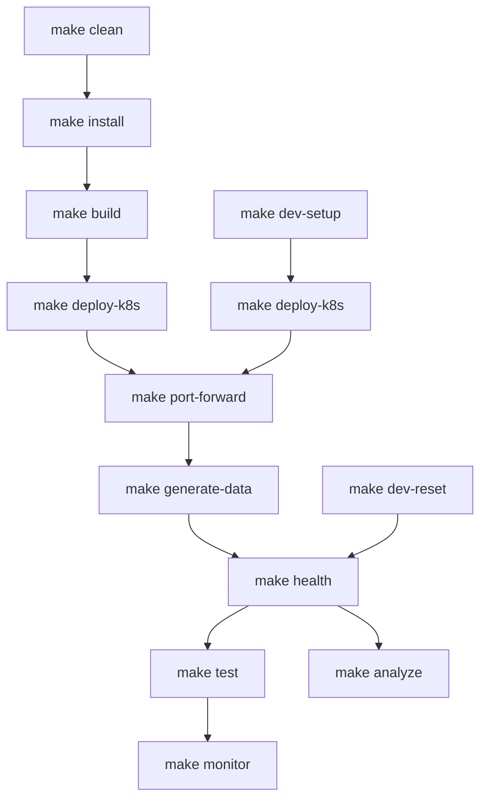

# E-Commerce Saga - Development Workflows

This document provides step-by-step workflows for different development scenarios using the Makefile commands.

## 📋 Table of Contents

- [Quick Reference](#quick-reference)
- [Initial Setup](#initial-setup)
- [Daily Development](#daily-development)
- [Testing Workflows](#testing-workflows)
- [Deployment Workflows](#deployment-workflows)
- [Monitoring & Maintenance](#monitoring--maintenance)
- [Troubleshooting](#troubleshooting)
- [Command Dependencies](#command-dependencies)

## 🎯 Quick Reference

### **Most Common Commands**
```bash
make dev-setup      # Complete development setup (install + setup + data)
make dev-reset      # Clean + deploy + generate data (fresh start)
make health         # Check all service health
make test           # Run all tests
make clean          # Clean up everything
```

### **Command Order Priority**
1. 🔧 **Setup**: `install` → `build` → `deploy-k8s` → `port-forward`
2. 📊 **Data**: `generate-data` → `check-consistency`
3. 🧪 **Testing**: `test-unit` → `test-func` → `test-chaos` → `test-perf`
4. 📈 **Monitoring**: `health` → `monitor` → `analyze`

---

## 🚀 Initial Setup

### **First Time Setup (New Environment)**

```bash
# Step 1: Install dependencies
make install

# Step 2: Build Docker images
make build

# Step 3: Deploy to Kubernetes (creates namespace)
make deploy-k8s

# Step 4: Wait for deployment (check pod status)
kubectl get pods -n e-commerce-saga
kubectl wait --for=condition=ready pod --all -n e-commerce-saga --timeout=300s

# Step 5: Setup port forwarding
make port-forward

# Step 6: Generate test data
make generate-data

# Step 7: Verify everything works
make health

# Step 8: Run initial tests
make test-unit
```

### **One-Command Setup (Recommended)**

```bash
# This combines install + setup + data generation
make dev-setup

# Then verify deployment and setup port forwarding
make deploy-k8s
make port-forward
make health
```

---

## 🔄 Daily Development

### **Standard Development Workflow**

```bash
# 1. Start with fresh environment (optional)
make dev-reset

# 2. Make your code changes
# ... edit files ...

# 3. Quick test your changes
make test-unit

# 4. Rebuild and deploy
make build
make deploy-k8s

# 5. Verify deployment
make health

# 6. Run comprehensive tests
make test
```

### **Quick Development Cycle**

```bash
# For minor changes, skip the reset
make build
make deploy-k8s
make health
make test-unit
```

### **Code Quality Check Before Commit**

```bash
make test           # All tests
make check-consistency
make analyze        # Log analysis
# Optional: make security-scan
```

---

## 🧪 Testing Workflows

### **Progressive Testing (Recommended Order)**

```bash
# 1. Fast feedback - Unit tests first
make test-unit

# 2. Integration testing
make test-func

# 3. Data integrity checks
make check-consistency

# 4. System resilience testing
make test-chaos

# 5. Performance testing (requires k6)
make test-perf
```

### **Comprehensive Test Suite**

```bash
# Run all tests in sequence
make test

# Or run CI-style tests
make ci-test
```

### **Specific Test Scenarios**

```bash
# Just functional tests
make test-func

# Just chaos engineering
make test-chaos

# Performance only (ensure k6 is installed)
make test-perf
```

---

## 🚀 Deployment Workflows

### **Kubernetes Development Deployment**

```bash
# Complete deployment workflow
make build
make deploy-k8s
make port-forward
make health
make monitor
```

### **Docker Compose Development**

```bash
# Alternative deployment for local development
make build
make deploy-compose
make health
make monitor
```

### **Production-Ready Deployment Preparation**

```bash
# CI/CD pipeline simulation
make ci-build       # Build for CI/CD
make ci-test        # Run CI tests
make deploy-k8s     # Deploy to staging
make test-perf      # Performance validation
make health         # Final health check
```

### **OpenShift Deployment**

```bash
# Use the provided scripts for OpenShift
./build-podman.sh
./push-images.sh
./deploy-openshift.sh

# Or use Helm
helm install e-commerce-saga ./helm --namespace e-commerce-saga
```

---

## 📊 Monitoring & Maintenance

### **Daily Monitoring Routine**

```bash
# Check system health
make health

# Review system performance
make monitor

# Analyze logs for issues
make analyze

# View service logs
make logs
```

### **Weekly Maintenance**

```bash
# Check log statistics
make logs-stats

# Compress old logs (7+ days)
make logs-compress

# Review data consistency
make check-consistency
```

### **Monthly Cleanup**

```bash
# Clean up old compressed logs (30+ days)
make logs-cleanup

# Database backup (optional)
make db-backup

# Security scan (when implemented)
make security-scan
```

---

## 🔧 Troubleshooting

### **Common Issues & Solutions**

#### **"Namespace not found" Error**
```bash
# Problem: Trying to port-forward before deployment
# Solution: Deploy first
make deploy-k8s
kubectl get pods -n e-commerce-saga
make port-forward
```

#### **Dependency Conflicts**
```bash
# Problem: Package conflicts in requirements.txt
# Solution: Clean install
pip uninstall -y -r requirements.txt
pip install -r requirements.txt
```

#### **Services Not Ready**
```bash
# Problem: Port forwarding fails
# Solution: Wait for pods to be ready
kubectl get pods -n e-commerce-saga
kubectl wait --for=condition=ready pod --all -n e-commerce-saga --timeout=300s
make port-forward
```

#### **k6 Installation Issues**
```bash
# k6 is not a Python package - install separately
# macOS:
brew install k6

# Ubuntu:
sudo apt-get update && sudo apt-get install k6

# Or skip performance tests temporarily
```

### **Reset Everything**

```bash
# Nuclear option - clean everything and start fresh
make clean
make dev-reset
make health
```

### **Debug Commands**

```bash
# Check Kubernetes resources
kubectl get all -n e-commerce-saga
kubectl describe pods -n e-commerce-saga

# Check Docker containers
docker ps -a
docker logs <container-name>

# Check port usage
lsof -i :8000-8004
netstat -tulpn | grep :800

# Kill port forwarding processes
pkill -f "kubectl port-forward"
```

---

## 📈 Command Dependencies



## 🎯 Workflow Scenarios

### **🆕 Brand New Project Setup**
```bash
git clone <repository>
cd e-commerce-saga
make install
make dev-reset
make health
make test
```

### **🔄 Daily Development**
```bash
make dev-setup      # or make dev-reset for fresh start
make test-unit
# Make code changes
make build && make deploy-k8s && make health
```

### **🧪 Testing & Validation**
```bash
make test-unit      # Quick feedback
make test-func      # Integration tests
make check-consistency
make test-chaos     # Resilience testing
```

### **🚀 Release Preparation**
```bash
make ci-test
make ci-build
make test-perf
make health
make tag-release
```

### **🗑️ Cleanup**
```bash
make clean          # Remove all deployments
make cleanup-data   # Remove test data
```

---

## 💡 Best Practices

### **Development Best Practices**
1. Always run `make health` after deployment
2. Use `make dev-reset` for clean environment
3. Run `make test-unit` frequently for quick feedback
4. Use `make monitor` for real-time system observation

### **Deployment Best Practices**
1. Always `make build` before `make deploy-k8s`
2. Wait for pods to be ready before port forwarding
3. Verify health before running tests
4. Use `make clean` to reset problematic states

### **Testing Best Practices**
1. Start with unit tests (`make test-unit`)
2. Run data consistency checks (`make check-consistency`)
3. Use chaos testing to validate resilience
4. Performance test with realistic load

### **Monitoring Best Practices**
1. Check health regularly (`make health`)
2. Monitor logs for patterns (`make analyze`)
3. Use centralized monitoring (`make monitor`)
4. Compress logs regularly (`make logs-compress`)

---

## 📞 Quick Help

```bash
# See all available commands
make help

# Check current system status
make health

# View documentation
make docs

# Get version information
make version
```

**Remember**: When in doubt, use `make dev-reset` for a fresh start! 